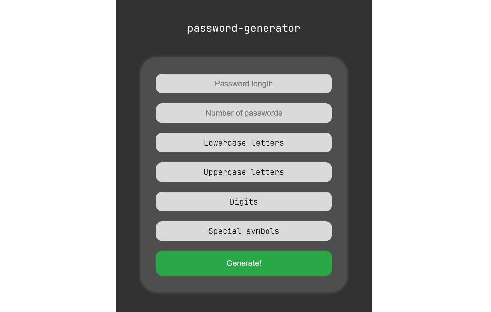

# password-generator

This is a simple password generator with minimal settings: the use of digits, uppercase and lowercase letters, as well as special characters.

## Features

1. Programming selected element to copy to the clipboard and adding a message for notification user that the password has been copied.
2. Adding backend of the project using FastApi or Flask.
3. Finally, adding a first test... :trollface:

## Functional

### First page

The first page of project contain the next functions:

1. You can write a password length and quantity of passwords.
2. You can choice what kind of characters you want to use in your password(s).
3. Finally, you can generate your password(s).

### Second page

>:hammer: **In the development**

The second page of project contain the next functions:

1. You can copy all passwords on the page.
2. You can choose any password on the page and copy it.
3. Finally, you can go to the first page.

>:dizzy: As you can see, the page has several types of display. It depends on the screen resolution of your device. I tried to make the page as responsive as possible.
If you have any ideas on how to make the page more responsive or beautiful, please send your idea to my email address <atakishiev32ruslan@gmail.com>.
